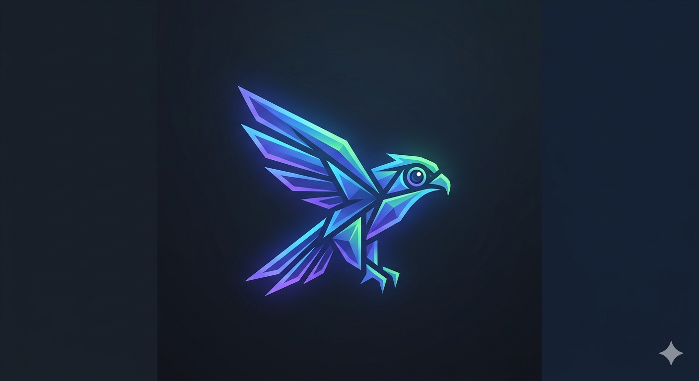

# VisionSharp
<p align="center">
  
</p>

A modern, fluent image manipulation library for **.NET 10**, inspired by [Intervention Image v4](https://image.intervention.io/v4).


[](https://dotnet.microsoft.com)
[](https://nuget.org)
[](LICENSE)

---

## Features

- **Fluent API** — chainable operations in a clean, readable style
- **Lazy pipeline** — operations are queued and executed only when a terminal method is called
- **Modular architecture** — abstractions, core engine, drawing, processing, and formats are separate packages
- **Pluggable engines** — designed for ImageSharp (default), SkiaSharp, and Magick.NET
- **Async-first** — all I/O is non-blocking with `CancellationToken` support
- **.NET 10** — latest C# features, nullable enabled, Span-based internals

---

## Quick Start

```csharp
using VisionSharp;
using VisionSharp.Abstractions.Enums;

// Resize + blur + watermark → save
var image = await ImageFactory
    .OpenAsync("photo.jpg")
    .Resize(1200, 800)
    .Blur(2)
    .Watermark("logo.png", WatermarkPosition.BottomRight)
    .DrawText("© 2026", x: 20, y: 30)
    .ToJpeg(90)
    .SaveAsync("output/result.jpg");

Console.WriteLine($"Done: {image.Width}×{image.Height}");
```

---

## Installation

```bash
dotnet add package VisionSharp.Imaging
```

---

## API Examples

### Load from any source

```csharp
// File path
ImageFactory.OpenAsync("photo.jpg")

// Stream
ImageFactory.OpenAsync(myStream)

// Byte array
ImageFactory.OpenAsync(bytes)

// Base64
ImageFactory.OpenBase64Async(base64String)

// URL (download is deferred until the terminal call)
ImageFactory.OpenAsync(new Uri("https://example.com/photo.jpg"))
```

### Resize

```csharp
// Exact dimensions
builder.Resize(800, 600)

// Only downscale (never enlarge)
builder.ResizeDown(800, 600)

// Proportional scale
builder.Scale(0.5)

// CSS object-fit: cover (crop-fill exact dimensions)
builder.Cover(500, 500)

// CSS object-fit: contain (fit within bounds)
builder.Contain(300, 300)
```

### Crop

```csharp
builder.Crop(50, 50, 400, 300)   // from (x, y) with size
builder.Crop(400, 300)            // centered crop
```

### Effects

```csharp
builder
    .Blur(3)
    .GaussianBlur(1.5f)
    .Grayscale()
    .Sepia()
    .Sharpen()
    .Pixelate(10)
    .Rotate(45f)
    .FlipHorizontal()
    .Brightness(0.1f)
    .Contrast(0.2f)
    .Opacity(0.8f)
```

### Watermark

```csharp
// Image watermark
builder.Watermark("logo.png", WatermarkPosition.BottomRight, opacity: 0.7f)

// Text watermark
builder.WatermarkText("© My Company 2026", opts =>
{
    opts.Position  = WatermarkPosition.BottomCenter;
    opts.FontSize  = 18;
    opts.Color     = "#FFFFFF";
    opts.Opacity   = 0.85f;
    opts.Bold      = true;
})
```

### Drawing

```csharp
using VisionSharp.Drawing.Extensions;

builder
    .DrawLine(0, 0, 500, 300, opts => opts.StrokeColor = "#FF0000")
    .DrawRectangle(10, 10, 200, 100, opts => opts.FillColor = "#0000FF88")
    .DrawCircle(250, 150, 50, opts => { opts.FillColor = "#FFFFFF"; opts.StrokeWidth = 2; })
    .DrawText("Hello", x: 30, y: 30, opts => { opts.FontSize = 24; opts.StrokeColor = "#000000"; })
    .DrawCircularAvatar("avatar.png", x: 20, y: 20, diameter: 100)
```

### Format conversion

```csharp
builder.ToJpeg(90)   // JPEG quality 1–100
builder.ToPng()
builder.ToWebp(80)
builder.ToGif()
builder.ToBmp()
```

### Terminal operations

```csharp
// Save to file
var image = await builder.SaveAsync("output.jpg");

// Get bytes
byte[] bytes = await builder.ToBytesAsync();

// Get Base64
string b64 = await builder.ToBase64Async();

// Get stream
Stream stream = await builder.ToStreamAsync();
```

### Format helpers (VisionSharp.Formats)

```csharp
using VisionSharp.Formats.Extensions;

byte[]  jpegBytes  = await builder.ToJpegBytesAsync(90);
string  pngDataUri = await builder.ToPngDataUriAsync();
string  webpUri    = await builder.ToWebpDataUriAsync(80);
```

### Utility extensions (VisionSharp.Extensions)

```csharp
using VisionSharp.Extensions;

// Conditional transform
builder.When(isGrayscale, b => b.Grayscale())

// Open-graph image (1200×630, JPEG q85)
builder.OpenGraph()

// Profile picture (square cover)
builder.ProfilePicture(256)

// Thumbnail (contain within 256px)
builder.AsThumbnail(256)

// Save same image to multiple formats concurrently
await builder.SaveToMultipleAsync(new[] { "out.jpg", "out.webp" });
```

### Processing presets (VisionSharp.Processing)

```csharp
using VisionSharp.Processing.Extensions;

builder.Vintage()         // sepia + light blur + soft contrast
builder.BlackAndWhite()   // grayscale + contrast + sharpen
builder.WarmTone()        // warm golden-hour tone
builder.CoolTone()        // desaturated cool look
builder.SoftFocus()       // gentle Gaussian glow
builder.Thumbnail()       // contain within 150px
```

---

## Dependency Injection

```csharp
// Program.cs (ASP.NET Core / Generic Host)
builder.Services
    .AddVisionSharp()
    .UseImageSharp();

// Inject IImageFactory anywhere
public class ImageController(IImageFactory factory)
{
    public async Task<byte[]> ProcessAsync(Stream input)
        => await factory.OpenAsync(input)
                        .Resize(800, 600)
                        .ToJpeg(85)
                        .ToBytesAsync();
}
```

---

## Architecture

```
VisionSharp.Abstractions
    IImage, IImageBuilder, IImageEngine, IImageFactory
    IImageEncoder, IImageDecoder, IImageEffect, IImageProcessor
    IWatermarkProcessor, IShapeDrawer
    Enums: WatermarkPosition, ImageFormat, ResizeMode, ShapeType
    Options: ResizeOptions, TextWatermarkOptions, DrawingOptions

VisionSharp.Core  (depends on Abstractions)
    ImageBuilder    — lazy fluent pipeline
    ImageSharpEngine — IImageEngine backed by SixLabors.ImageSharp
    VisionImage     — immutable result object
    Exceptions      — ImageProcessingException, WatermarkException, …

VisionSharp.Drawing  → DrawingBuilderExtensions
VisionSharp.Processing → ProcessingBuilderExtensions (presets)
VisionSharp.Formats  → FormatBuilderExtensions (data-URI helpers)
VisionSharp.Extensions → ImageBuilderExtensions (When, Apply, …)

VisionSharp  (facade)
    ImageFactory    — static entry point
    DI extensions   — AddVisionSharp().UseImageSharp()
```

Design patterns used: **Fluent API**, **Strategy**, **Factory**, **Adapter**, **Pipeline**, **Builder**, **DI**.

---

## Performance

| Operation | 1920×1080 source | Time (avg) |
|-----------|-----------------|-----------|
| Resize → 800×600 | JPEG | ~35 ms |
| Cover 500×500 | JPEG | ~38 ms |
| Grayscale | JPEG | ~22 ms |
| Gaussian Blur σ=2 | JPEG | ~55 ms |
| JPEG encode q=90 | 800×600 | ~12 ms |
| WebP encode q=80 | 800×600 | ~18 ms |

Run benchmarks:

```bash
dotnet run -c Release --project tests/VisionSharp.Benchmarks
```

---

## Contributing

1. Fork the repo
2. Create a feature branch (`git checkout -b feature/my-feature`)
3. Add tests for new functionality
4. Run `dotnet test` — all tests must pass
5. Submit a pull request

---

## License

MIT © 2026 VisionSharp Contributors
